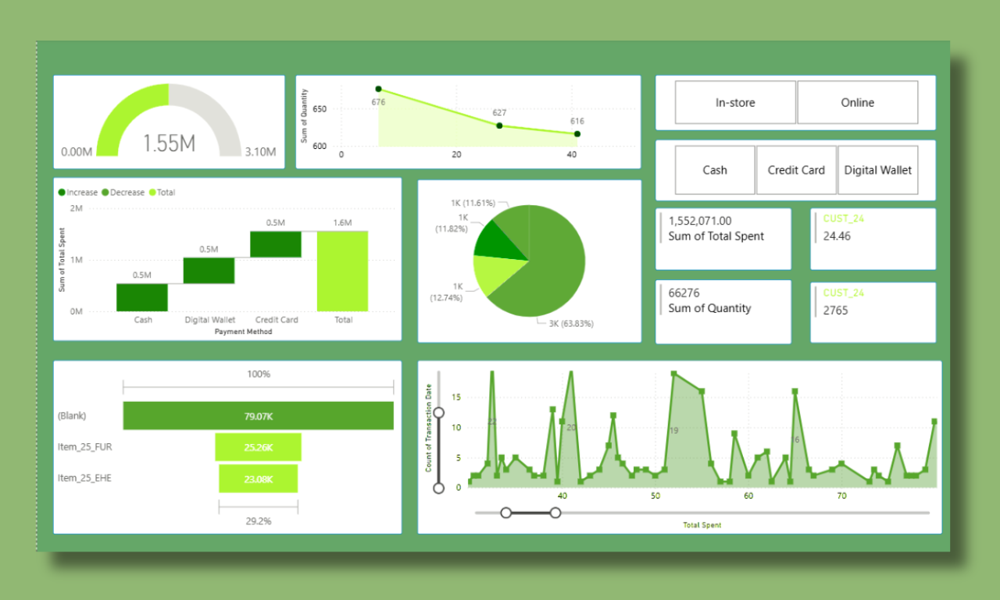

## 📊 Retail Store Analytics Dashboard – Power BI

A professional interactive Power BI dashboard designed to help retail businesses analyze sales performance, inventory levels, and customer trends through clear and actionable visualizations.

---

## 🔍 Project Overview

This project focuses on analyzing retail store data to provide insights into revenue, product performance, stock management, and customer behavior using Microsoft Power BI.

---

## 🖼 Dashboard Preview

---

## 🎥 Dashboard Video Walkthrough

Click below to watch the short demo of the dashboard:

➡️ [Watch Dashboard Video]([video/Dashboard-Walkthrough.txt](https://github.com/Wania-Irfan-26/Retail-Store-Dashboard/blob/main/Video/Dashboard-Walkthrough.txt))

---

## 🚀 Key Features

Interactive slicers and filters

Clean and easy-to-read visual layout

KPI cards for quick insights

Product-wise and category-wise analysis

Sales and profit trend charts

---

## 📁 Files in This Repository

Retail Store Analytics.pbix → Full Power BI report file

Retail Store Dashboard.png → Screenshot preview of the dashboard

video folder → Contains dashboard walkthrough link

---

## 🛠 How to Use

Download the .pbix file from this repository

Open it using Power BI Desktop

Explore the interactive dashboard

---

## 👩‍💻 Creator

Wania Irfan
Power BI Dashboard Developer
